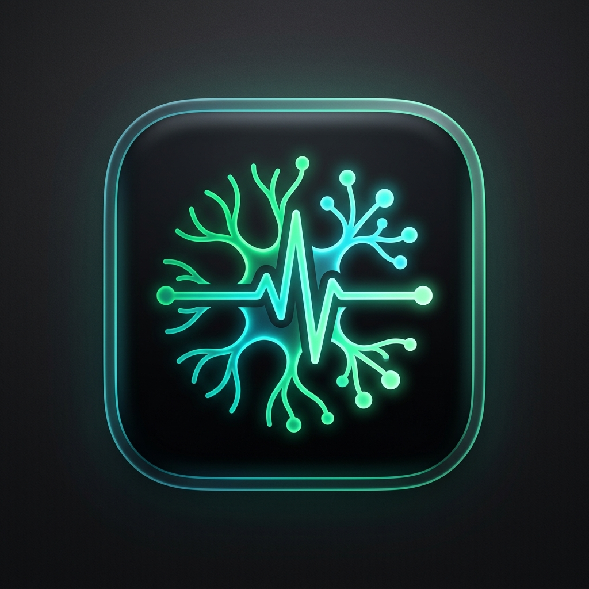

# Synapse-OS — Rural Health Mobile App (Android)

<p align="center">
  
</p>

A lightweight, dedicated Android healthcare application designed for rural and underserved communities across India. Built on **React Native 0.74.5 (Hermes engine)**, connecting seamlessly to the **Synapse-OS FastAPI multi-agent backend**.

---

## 📱 Application Overview

- **Application ID:** `com.synapseos.health`
- **Application Name:** `SynapseOS Rural Health`
- **Target OS:** Android 7.0+ (API Level 24 to 34)
- **Architecture:** Classic React Native (`newArchEnabled=false`) with Hermes JS engine, ensuring compatibility with Daily.co WebRTC native modules.
- **Security Posture:** Zero client secrets. Private keys, API tokens, and webhook secrets reside exclusively on the server.

---

## 🩺 The 8 Core Modules

### 1. ABHA Profile & Health Records (ABDM Sandbox)
- Verified digital health identity displaying national tricolor card, official ABHA ID (`91-XXXX-XXXX-XXXX`), `@abdm` address, PM-JAY policy number, and linked Health Information Provider (HIP) facility.
- Includes 6 pre-configured verified citizen profiles (Mausam Kar, Rachit Tiwari, Mangal Singh, Surabhi Kumari, Shaikh Warsi, Jiya Jaiswal) for testing across diverse demographics and state jurisdictions.
- PDF Health Passport generator and native share sheet integration.

### 2. AI Healthcare Text Chatbot
- Backed by `POST /api/orchestrate` with channel identifier `mobile`.
- Multi-agent clinical reasoning engine (Triage Agent, Clinical Agent, Pharmacology Agent, Consensus Council).
- **Critical Emergency Intercept:** Automatic keyword and intent classification triggers high-visibility emergency banners with one-tap 108/112 direct dialing.
- Expandable Multi-Agent Swarm Council trace showing step durations and consensus percentage.
- One-tap localized prompt chips for common rural health concerns (fever, ORS preparation, Dolo 650 dosage, infant immunization).

### 3. Vapi-Powered Clinical Voice Agent
- Integrated via `@vapi-ai/react-native` and `@daily-co/react-native-webrtc`.
- Live pulsating multi-ring **VoiceOrb** matching the clinical diagnostic visual interface.
- Microphone permission negotiation (`android.permission.RECORD_AUDIO`).
- Seamless state transitions (`idle`, `connecting`, `listening`, `speaking`, `muted`, `ended`).
- Live conversational transcript stream.
- Transparent offline/sandbox simulation fallback when external Vapi keys are unconfigured.

### 4. Eleven-Language Multilingual Support
Full UI translation and clinical prompt localization across **11 official Indian languages**:
1. 🌐 **English** (`en`)
2. 🇮🇳 **हिन्दी (Hindi)** (`hi`)
3. 🇮🇳 **বাংলা (Bengali)** (`bn`)
4. 🇮🇳 **தமிழ் (Tamil)** (`ta`)
5. 🇮🇳 **తెలుగు (Telugu)** (`te`)
6. 🇮🇳 **मराठी (Marathi)** (`mr`)
7. 🇮🇳 **ગુજરાતી (Gujarati)** (`gu`)
8. 🇮🇳 **ಕನ್ನಡ (Kannada)** (`kn`)
9. 🇮🇳 **മലയാളം (Malayalam)** (`ml`)
10. 🇮🇳 **ਪੰਜਾਬੀ (Punjabi)** (`pa`)
11. 🇮🇳 **ଓଡ଼ିଆ (Odia)** (`or`)

### 5. Blockchain / IPFS Health Record Verification
- AES-256-GCM encrypted health documents pinned to IPFS.
- SHA-256 content hashes anchored to Ethereum Sepolia smart contract:
  `0xd661e3bEB3Bd4Aa5821069bEA67d6f19d0ef01cA`
- In-app verification modal displaying contract address, block number, IPFS CID, and direct Etherscan link.

### 6. Official WhatsApp Connectivity & AGENTS.md Simulator
- Direct deep-link launcher to the official WhatsApp clinical bot (`wa.me/15552028141?text=Hi`).
- Real-time Meta Cloud API service readiness badge.
- **In-App Plain-Text Simulator:** 100% compliant with repository `AGENTS.md` rules:
  - Zero markdown syntax (no `*`, `**`, `_`, `#`, `---`, or backticks).
  - Clean structure with Unicode divider (`━━━━━━━━━━━━━━━━━━━━`), Suspected Diagnosis, Council Consensus, Immediate Actions, India-specific medications (Dolo 650, Electral ORS, Pan-40), emergency red flags, and quick shortcuts (`1`, `2`, `sos`, `5`).

### 7. Rural Health Quick Actions & Persistent Emergency SOS
- Instant action cards for symptom checking, medicine safety, infant immunization schedules, and hospital locator.
- Offline rural clinical action guides (ORS preparation, snakebite protocol, maternal anemia, water purification, heatstroke defense, TB DOTS).
- Persistent 1-tap SOS banner and floating modal providing instant phone dialer shortcuts for **108 (Ambulance)**, **112 (National Emergency)**, **14416 (Tele-MANAS)**, and **1091 (Women Helpline)**, with GPS dispatch integration.

### 8. Hardened Backend & Secure Local Persistence
- Client preferences, active profile, and offline cache stored via encrypted storage.
- Dynamic backend host switching modal (toggle between `10.0.2.2:8000` for Android emulator, LAN IP for physical device testing, or custom hosted HTTPS URLs).

---

## 🛠️ Project Directory Structure

```
mobile/
├── android/                   # Native Android Gradle project (compileSdk 34, minSdk 24)
│   ├── app/
│   │   ├── build.gradle       # App configuration, packaging options, signing
│   │   └── src/main/
│   │       ├── AndroidManifest.xml # Permissions (Audio, Internet, Phone)
│   │       └── res/           # Launcher icons (mdpi to xxxhdpi) and strings
├── src/
│   ├── api/
│   │   ├── client.ts          # Axios client with timeout, retry, dynamic host
│   │   └── endpoints.ts       # Typed API callers matching FastAPI routes
│   ├── assets/images/         # Patient avatars, ABHA card, app icon
│   ├── components/
│   │   ├── common/
│   │   │   ├── AppHeader.tsx            # Header with profile, language, network, SOS
│   │   │   ├── EmergencySOSModal.tsx    # 108/112 dialer modal
│   │   │   ├── LanguagePickerModal.tsx  # 11-language modal with native scripts
│   │   │   └── NetworkSettingsModal.tsx # Runtime API URL editor
│   │   └── VoiceOrb.tsx       # Animated pulsing diagnostic orb
│   ├── context/
│   │   ├── AuthContext.tsx    # Citizen profile state & switcher
│   │   ├── LanguageContext.tsx # 11-language runtime state
│   │   └── NetworkContext.tsx # Connectivity & health readiness
│   ├── data/
│   │   ├── mockProfiles.ts    # 6 verified citizen profiles
│   │   └── ruralTopics.ts     # Offline educational guides
│   ├── i18n/
│   │   └── translations.ts    # Complete 11-language clinical dictionaries
│   ├── navigation/
│   │   └── BottomTabNavigator.tsx # 5 core accessible tabs (>=48dp touch targets)
│   ├── screens/
│   │   ├── HomeScreen.tsx     # Home dashboard & quick actions
│   │   ├── ChatScreen.tsx     # Swarm AI text copilot with emergency intercept
│   │   ├── VoiceScreen.tsx    # Vapi voice triage & live transcript
│   │   ├── RecordsScreen.tsx  # ABHA card & Sepolia blockchain verification
│   │   ├── WhatsAppScreen.tsx # WhatsApp deep link & AGENTS.md simulator
│   │   └── RuralTopicDetailModal.tsx # Offline guide viewer
│   ├── storage/
│   │   └── secureStorage.ts   # Persistent local storage
│   └── types/
│       └── index.ts           # TypeScript models and interfaces
├── App.tsx                    # Root provider tree
├── index.js                   # Application entry point
└── package.json               # NPM dependencies
```

---

## 🚀 Building & Running

### Prerequisites
- Node.js >= 18
- JDK 17 or JDK 21 (configured in `JAVA_HOME`)
- Android SDK (API 34, Build-Tools 34.0.0, Platform-Tools)

### Install Dependencies
```bash
cd mobile
npm install
```

### Run Tests
```bash
npm test
```

### Build Signed Release APK
```bash
cd android
./gradlew assembleRelease
```
The output signed APK is generated at:
`android/app/build/outputs/apk/release/app-release.apk`

Copy to the artifact directory:
`artifacts/SynapseOS-Rural-Health-release.apk`
